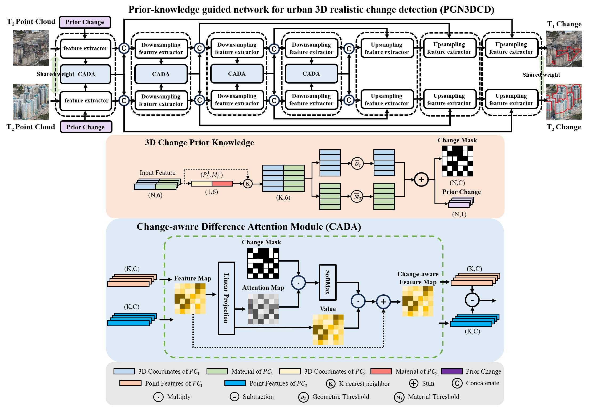

# PGN3DCD: Prior-Knowledge-Guided Network for Urban 3D Point Cloud Change Detection
Wenxiao Zhan and Jing Chen (Submitted to ISPRS Journal of Photogrammetry and Remote Sensing, 2024)

This Git project is built upon Torch-Point3D depository to share code for PGN3DCD networks for 3D point clouds change segmentation. See our up-coming paper for more details.

<p align="center">
         
</p>

# Overview

We introduce a new dataset, HKCD, and proposes a novel model, PGN3DCD, for 3D change detection.

## Requirements

- CUDA 10 or higher (if you want GPU version)
- Python 3.7 or higher + headers (python-dev)
- PyTorch 1.8.1 or higher (PyTorch >= 1.9 is recommended)
- A Sparse convolution backend (optional) see [here](https://github.com/nicolas-chaulet/torch-points3d#3d-sparse-convolution-support) for installation instructions

Install with

```bash
pip install torch
pip install torch-points3d
```

## Project structure

```bash
├─ benchmark               # Output from various benchmark runs
├─ conf                    # All configurations for training nad evaluation leave there
├─ notebooks               # A collection of notebooks that allow result exploration and network debugging
├─ docker                  # Docker image that can be used for inference or training
├─ docs                    # All the doc
├─ eval.py                 # Eval script
├─ find_neighbour_dist.py  # Script to find optimal #neighbours within neighbour search operations
├─ forward_scripts         # Script that runs a forward pass on possibly non annotated data
├─ outputs                 # All outputs from your runs sorted by date
├─ scripts                 # Some scripts to help manage the project
├─ torch_points3d
    ├─ core                # Core components
    ├─ datasets            # All code related to datasets
    ├─ metrics             # All metrics and trackers
    ├─ models              # All models
    ├─ modules             # Basic modules that can be used in a modular way
    ├─ utils               # Various utils
    └─ visualization       # Visualization
├─ test
└─ train.py                # Main script to launch a training
```

## HKCD Dataset

You can download the HKCD by this link "https://pan.baidu.com/s/1cQFjI04trgf5eMBvDTS4zg" and email the "zhanwenxiao@whu.edu.cn" to get the password.

## Inference

You can train the model by

```bash
python trainSiamKPConv.py
```
